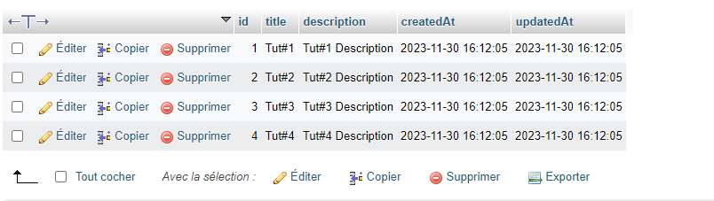
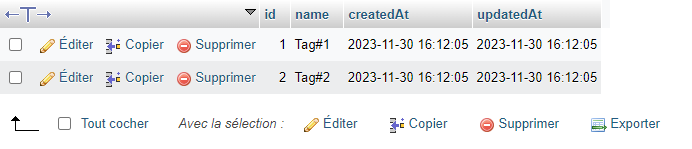
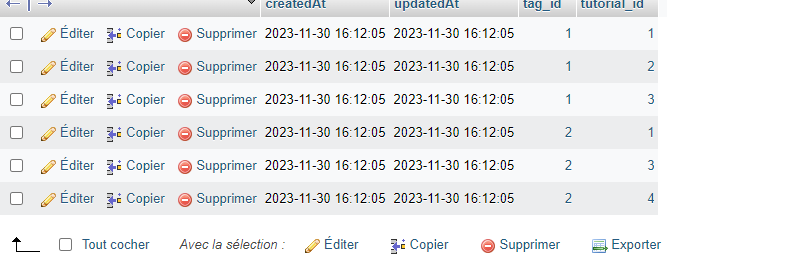
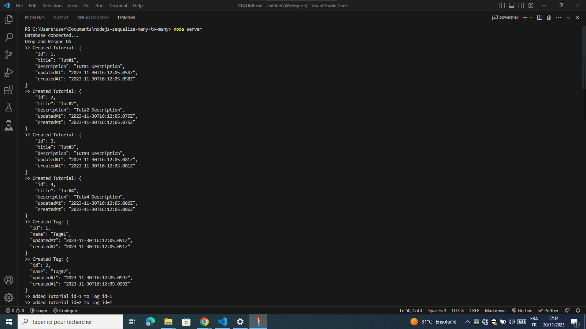
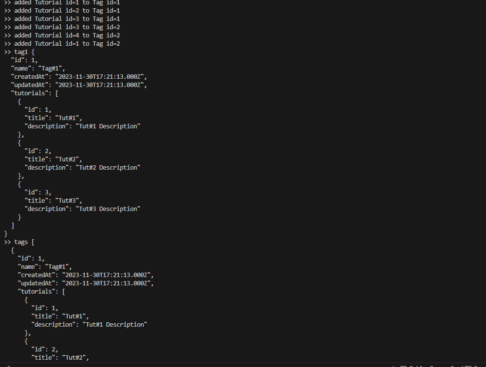

# Exemple d'association séquelle plusieurs-à-plusieurs – Node.js et MySQL

Dans l'analyse des systèmes, une relation plusieurs-à-plusieurs se produit entre deux entités lorsqu'une relation un-à-plusieurs entre elles fonctionne dans les deux sens :
- Un élément de A peut être lié à plusieurs éléments de B.
- Un membre de B peut être lié à de nombreux éléments de A.

Par exemple, supposons que vous souhaitiez concevoir des modèles de données de blog de Tutorial, vous pouvez penser qu'un Tutorial comporte de nombreuses Tag et qu'une Tag peut pointer vers plusieurs Tutorial.

Ce type de relation est représenté dans une base de données par une table de jointure : Tutorial_Tag (alias table de pontage, de jonction ou de liaison).
La relation entre l’entité Tutorial et l’entité Tag est donc plusieurs à plusieurs. Nous avons procéder étape par étape :

+ Tout d'abord, nous qvons configurer l'application Node.js
+ Ensuite, configurez la base de données MySQL et Sequelize
+ Définir les modèles Sequelize et initialiser Sequelize
+ Ensuite, nous créons le contrôleur pour créer et récupérer des entités
+ Enfin, nous lançons l'application pour vérifier le résultat


## Séquelle l'implémentation plusieurs-à-plusieurs dans Node.js

Créer une application Node.js
Tout d'abord, nous créons un dossier :

```
$ mkdir nodejs-sequelize-many-to-many
$ cd nodejs-sequelize-many-to-many
```


Ensuite, nous initialisons l'application Node.js avec un fichier package.json :

`name: (nodejs-sequelize-many-to-many) 
version: (1.0.0) 
description: Node.js Sequelize Many to Many Association example
entry point: (index.js) server.js
test command: 
git repository: 
keywords: nodejs, sequelize, many-to-many, associations, relationship
author: idriss
license: (ISC)

Is this ok? (yes) yes`


Ensuite on installe les modules nécessaires : sequelize, mysql2avec la commande :

```
npm install sequelize mysql2 --save
```


### Vérifier la base de données :

- table tutorials :



- table tags :



- table tutorial_tag :



- Resultats des requêtes sql  :






##Instruction pour Configuration du projet après  clonage
   
Dans le répertoire du projet, vous pouvez exécuter :

```
npm install
# or
yarn install
```

ou


### Compile et recharge à chaud pour le développement

```
node server.js 

```


